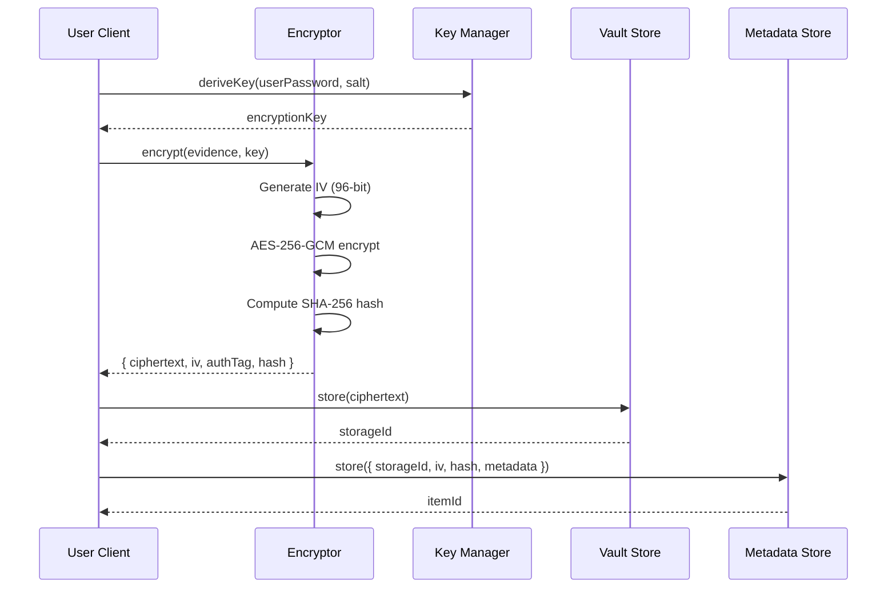
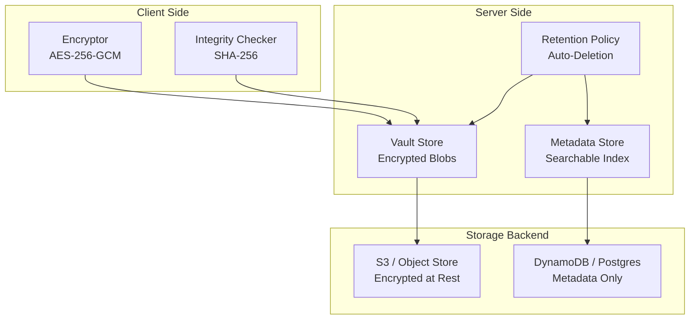
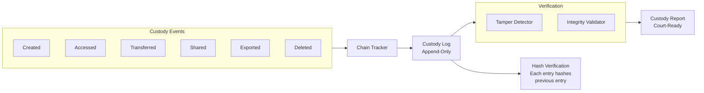
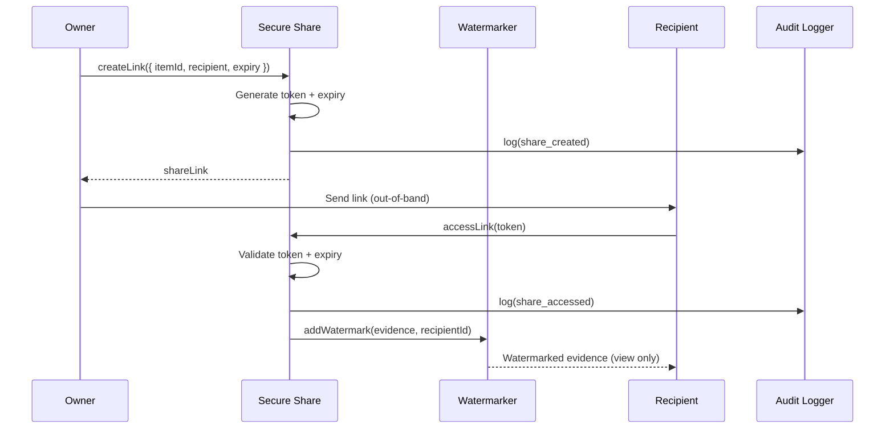
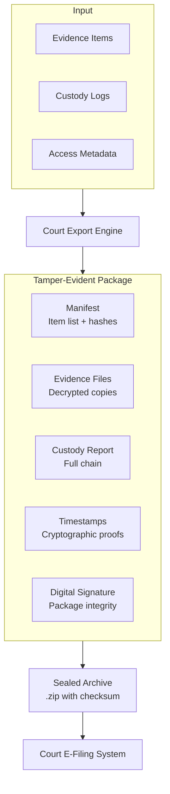

# Evidence Vault — Architecture

## Overview

The Evidence Vault uses a defense-in-depth architecture: client-side encryption ensures the server never sees plaintext, chain-of-custody tracking records every access event, and tamper-evident hashing proves integrity. The system is designed so that no single compromise can expose evidence.

## 1. Encryption Flow

## 2. Storage Architecture

## 3. Chain-of-Custody Model

## 4. Secure Sharing Flow

## 5. Court Export Pipeline

## Key Design Decisions

1. **Client-side encryption** — the server never has access to plaintext evidence or encryption keys, protecting against server-side breaches.
2. **Hash-chain custody log** — each custody event includes the hash of the previous event, making tampering detectable without blockchain overhead.
3. **Separation of data and metadata** — encrypted blobs and searchable metadata are stored in different systems, so metadata queries never touch evidence data.
4. **Watermarked sharing** — shared evidence includes invisible watermarks tied to the recipient, enabling leak tracing.
5. **Court-ready export** — the export pipeline produces self-contained, tamper-evident packages that satisfy evidence admission requirements.
