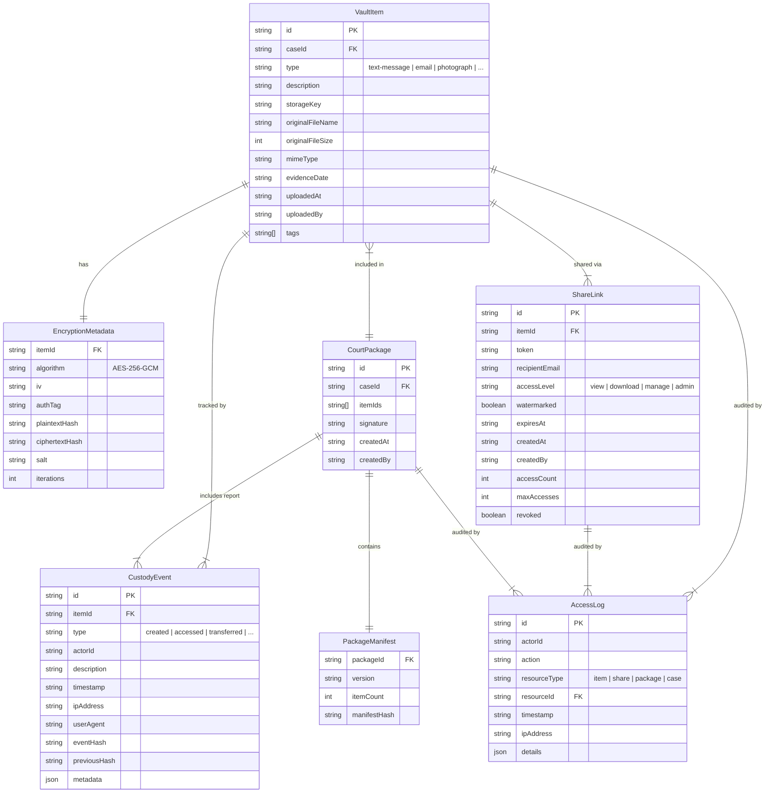

# Data Model — Evidence Vault

Entity-relationship diagram showing the core data structures and their relationships.

## Entity Descriptions

| Entity | Purpose |
|--------|---------|
| **VaultItem** | A single piece of evidence stored in encrypted form |
| **EncryptionMetadata** | Cryptographic parameters needed to decrypt a vault item |
| **CustodyEvent** | A tamper-evident event in the chain of custody |
| **ShareLink** | A time-limited, tokenized URL for sharing evidence |
| **AccessLog** | An audit entry recording who accessed what and when |
| **CourtPackage** | A sealed bundle of evidence prepared for court submission |
| **PackageManifest** | An integrity manifest listing items and their hashes |
